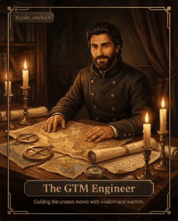

# Gabe

GTM Engineer · Forward Deployed AI Engineer

Hi, I'm Gabe. For 15 years, I've worked in marketing at the point where how a product works meets why it matters. Over the last five, I've brought that perspective to GTM engineering and applied AI.

That means I care about clear sentences, good product taste, and systems people can use. Lately, I've been doing agent plumbing: finding what slows a team down and building the AI systems that fix it.

My working set includes Python, SQL, RAG, embeddings, vector databases, MCP, agentic systems, evals, context engineering, TypeScript, JavaScript, and the APIs around them.

How I think about work and AI: [this video](https://x.com/gabe_onchain/status/2090524446826082779), [this tweet](https://x.com/gabe_onchain/status/2092893848510800221), [this doc](https://github.com/gabchess/operating-thoughts/blob/main/how-i-think-about-ai.md), and [this one on GTM](https://github.com/gabchess/operating-thoughts/blob/main/how-i-think-about-gtm.md).

---

## ✦ Building now

| Project | Stack | What it does |
|:--|:--|:--|
| **[Tixmancer](https://tixmancer.xyz)** |   | AI agent that finds overlooked secondhand items and checks asking prices against your limit, working toward buying below market value. |
| **[Hedwig](https://github.com/gabchess/hedwig-sol)** |  | Shared, revocable roles for related Solana apps: each app authenticates its users or agents and checks their access onchain. |

## ▸ GTM engineering

| Project | Stack | What it does |
|:--|:--|:--|
| **[prospector](https://github.com/gabchess/prospector)** |   | Forkable outbound lead pipeline: two scrapers, Clay enrichment, ICP gates, human approval; ran 100 leads in 48 hours for $4. |
| **launch-factory** |   | Release folder in, launch package out: six assets plus a campaign plan, claims source-traced, human-gated; private for now. |
| **[scout-portfolio-manager](https://github.com/gabchess/scout-portfolio-manager)** |   | AI agent on the Zerion API: explainable PnL, technical analysis, DCA windows/alerts, etc. |

## ◆ Custom Designed AI Harness

A harness I have designed and fine-tuned for months: **HyperBots**. 32 specialists, one routing layer, deterministic gates that block a bad ship before it leaves the machine.

Most agent stacks are one generalist taking orders, one prompt at a time. This is an operating layer I engineered instead: context budgeted per seat, routing tested like code, verification mechanized rather than trusted.

&rarr; **Router, not menu.** State the outcome; routing picks the specialist, tie-breaks pre-judged in writing. 
&rarr; **Mechanical gates.** A pre-ship gate blocks every push until a reviewer signs the exact commit. One push-owner. Nothing publishes, sends, or spends without a human. 
&rarr; **Verification as code.** Hash manifests diff source against installed runtime, trigger-eval suites gate routing changes, CI catches drift before merge.

| Harness | What it does | Access |
|:--|:--|:--|
| **HyperBots** | 32 specialists across planning, code, review, security, copy, SEO, and research; every incident becomes a mechanical rule, so the same bug cannot ship twice. | Private, invite only. |

The bought kits stop at the code. This one runs first commit to launch day: the same crew builds the feature, gates the ship, writes the launch copy, and tracks whether AI engines cite it.

## ▣ Augments

An augment is a folder that teaches an AI assistant a whole job. In plain English, it is onboarding for an AI employee, plus guardrails that stop it from cutting corners, zipped so anyone can install it.

Every augment here is three parts:

&rarr; **Skills** = the SOPs. Step-by-step playbooks the AI follows for each task. 
&rarr; **Hooks** = the guardrails. Automatic checks that block the AI the moment it breaks a rule, instead of trusting it to remember. 
&rarr; **README** = the manual. A stranger installs and runs the whole thing without me in the room.

Three augments, each one shipped real work before it earned a row:

| Augment | What it does | Access |
|:--|:--|:--|
| **[Cinematic-site-builder](https://github.com/gabchess/cinematic-site-builder)** | Built my [website](https://gabeonchain.com) with this augment: brief in, scroll-driven cinematic 3D site out, every build Playwright-verified to actually move before it passes. | Private for now, invite only. |
| **[Product demo video template](https://github.com/gabchess/product-demo-video-template)** | Product URL or script in, rendered 60-90s demo video out, lint-verified before render. | Private for now, invite only. |
| **[SEO & AEO tracker](https://github.com/gabchess/seo-aeo-tracker)** | Tracks and fixes how a brand shows up in Google and in AI answers; proof of work: [Gabriel Paz's studio site](https://ateliergabrielpaz.vercel.app/), built and SEO-run by this lane, now waitlisting students who find him through search. | Private for now, invite only. |

## ⬡ Solana & onchain

| Project | Lang | What it does |
|:--|:--|:--|
| **[worldcup-pari-market](https://github.com/gabchess/worldcup-pari-market)** |   | Proof-settled World Cup prediction markets on Solana, devnet with 39 Rust tests; [demo](https://youtu.be/2Vh6RPLNd-U). |
| **[kageb](https://github.com/gabchess/kageb)** |  | Private intent pooling for Solana: four real orders in, one aggregate trade out. |
| **[grimoire](https://github.com/gabchess/grimoire)** |  | The Solana Transaction Doctor: paste a failed signature, get the root cause and fix in plain English, live demo. |
| **[solana-ship-gate](https://github.com/gabchess/solana-ship-gate)** |  | Pre-deploy safety gate for Solana programs: 4 deterministic checks, blocks unsafe mainnet deploys, MIT licensed. |
| **[patronus](https://github.com/gabchess/patronus)** |  | Onchain-attested, runtime-scoped credentials for AI agents on Solana DeFi. |
| **[worldcup-settlement](https://github.com/gabchess/worldcup-settlement)** |  | An AI agent that bets on live World Cup matches on Solana, autonomously. |
| **[meteora-jup-sol-safety-monitor](https://github.com/gabchess/meteora-jup-sol-safety-monitor)** |  | Read-only Meteora DLMM PnL and safety monitor with Telegram alerts. |
| **[solguard](https://github.com/gabchess/solguard)** |  | Warns Solana users before they get rugged: scores new pump.fun launches on deployer history, liquidity, mint authority, posts risk live. |
| **[superteam-academy](https://github.com/gabchess/superteam-academy)** |  | Gamified learning for Solana devs: browser editor, XP, onchain certificates, built for Superteam Brazil. |
| **[mermail-defi-navigator](https://github.com/Nudgen-Marketing/mermail-skills/pull/145)** |  | Reads a DeFi email as untrusted data, explains the real yield mechanism, then proposes at most one capped wallet action for Mermail's PayBox to sign. |

## ◈ Agents & AI tooling

| Project | Lang | What it does |
|:--|:--|:--|
| **[silvia](https://github.com/gabchess/silvia)** |  | Food-ordering assistant for older adults: chat instead of learning an app, 50+ completed orders. |
| **[safeskill](https://github.com/gabchess/safeskill)** |  | One-click security audit for your MCP setup: one score, plain English, no CLI required. |
| **[wingman](https://github.com/gabchess/wingman)** |  | AI Expert Marketplace: install experts (Design, Code, Marketing) into Claude Code. |
| **[clawmanship](https://github.com/gabchess/clawmanship)** |  | Reviewable decision before a community skill enters a local bundle. |
| **[agenthub](https://github.com/gabchess/agenthub)** |  | Monad-native AI agent orchestration platform. |
| **[hermes-aria-theme](https://github.com/gabchess/hermes-aria-theme)** |  | Black and white dashboard theme for the Hermes agent: green for success, red for errors, nothing else. |

## ◇ EVM & multichain

| Project | Lang | What it does |
|:--|:--|:--|
| **[walletbrief-monad](https://github.com/gabchess/walletbrief-monad)** |  | Persistent Monad wallet briefs with human-approved, revoke-only EIP-7702 execution. |
| **[yieldpilot](https://github.com/gabchess/yieldpilot)** |  | AI copilot for cross-chain yield optimization, built for the Chainlink Convergence Hackathon 2026. |

## ▤ Data & analysis

| Project | Lang | What it does |
|:--|:--|:--|
| **[beat-claude-engineer-004-analytics-pipeline](https://github.com/gabchess/beat-claude-engineer-004-analytics-pipeline)** |  | Analytics pipeline for the Beat Claude engineer-004 challenge: anomaly detector, test suite, hot-path benchmark. |
| **[ecommerce-sales-analysis](https://github.com/gabchess/ecommerce-sales-analysis)** |  | E-commerce sales analysis with Python (pandas, matplotlib) and SQL: RFM segmentation, revenue trends, product performance. |
| **[solana-narrative-tracker](https://github.com/gabchess/solana-narrative-tracker)** |  | Spots emerging Solana narratives early: tracks 20+ KOLs and dozens of repos, ships build ideas every fortnight. |
| **[defillama-tvl-anomaly-detector](https://github.com/gabchess/defillama-tvl-anomaly-detector)** |  | Scans DeFi TVL for what looks wrong: zeroed, -50% in a day, +300% spike, or flat 60 days, catching broken adapters and depegs. |

## ▲ Security research

Security researcher, 4 bounties paid. A high-severity Anchor bug in LazyAccount ([writeup, PoC, fix](https://github.com/gabchess/anchor/pull/1), upstream shipped the same fix five weeks later), a fund-lockup bug in Ern Protocol via Immunefi, and two Quantus findings via Immunefi: guardian enrollment without consent in `set_high_security`, and scheduled transfers below the existential deposit stranding funds with no owner-accessible recovery. Other reports stay unpublished while under review, per program terms.

Also built the [Solana Vault Standard Extension](https://github.com/gabchess/solana-vault-standard/tree/feat/svs-7-native-sol-vault) for a Superteam Brazil bounty.

## ✎ Writing

I write about GTM engineering, all things marketing, web3, proof, evals, and opinions at [my blog](https://gabeonchain.com/#writing).

## Find me

[gabeonchain.com](https://gabeonchain.com) · [X @gabe_onchain](https://x.com/gabe_onchain) · [LinkedIn](https://www.linkedin.com/in/gabeonchain)
